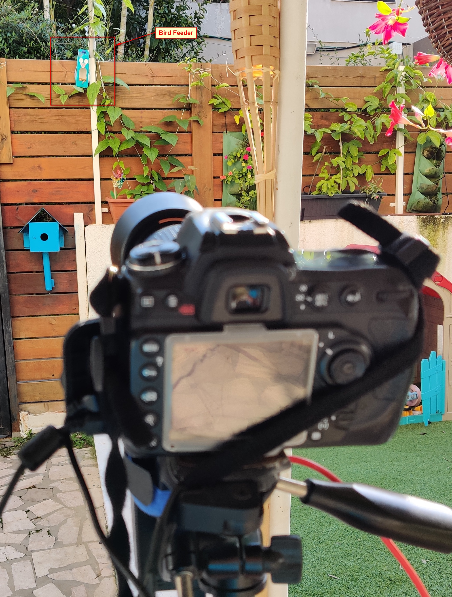
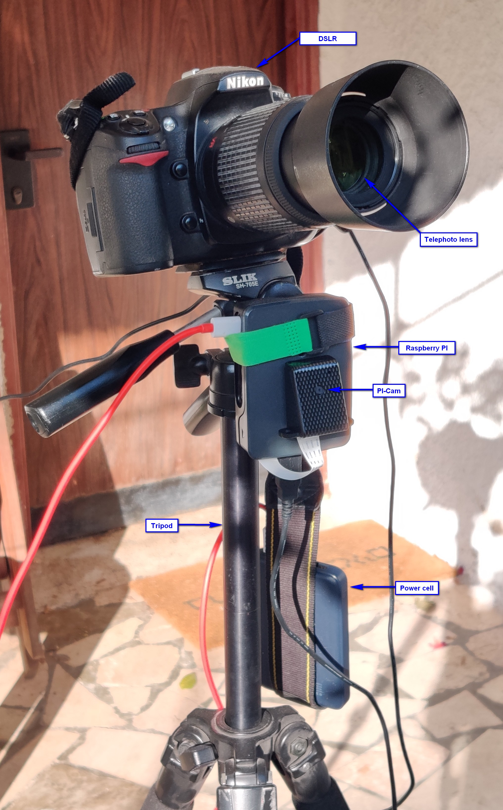
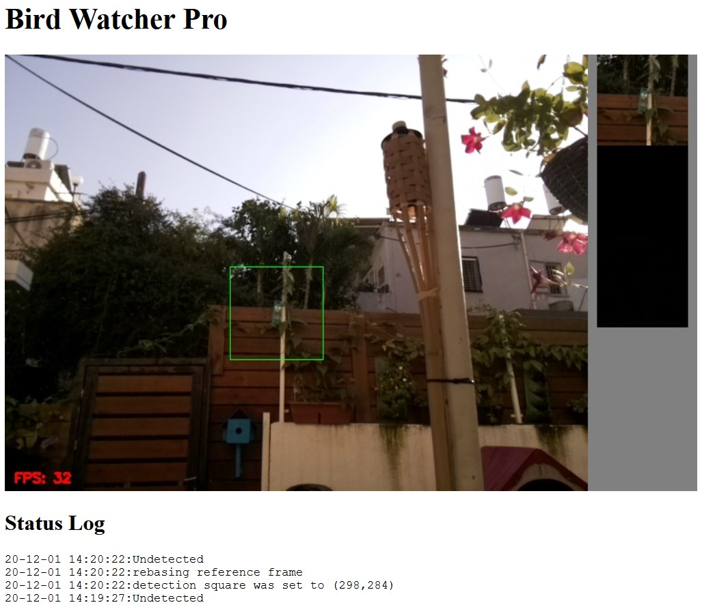

# Bird Watcher
Bird Watcher is a photography trigger designed to automatically capture photos of birds and other animals in the wild.

The tool is designed to run on a Rasberry Pi equipped with Pi-cam (but can run on any machine with a webcam). The Pi-cam feed is set to watch a chosen area of interest (e.g. bird feeder). Using motion detection algorithms (using OpenCV), it automatically triggers a connected DSLR camera (thru a USB cable using libgphoto2) when an objects enters the specified area. Live feed can be watched from a designated web UI.

### Features
- set the capture detection area from the live feed in the web GUI
- control the size, sensitivity, and exposure time of detected object before triggering a shot.
- continuous shooting as long as the object remains in the capture area.
- automatic self-adjusting motion detection algorithm to cope with changing environment such as time of day, cloud, winds etc.
- a multi-process asynchronous architecture allows smooth control of cameras without locking I/O (gphoto2 is notorious for that)

### Installation

1. Install OS. PI OS recommended but any flavor of debian will do.
2. clone this repository into a new folder. 
3. create a venv (recommended). python 3.6+ required.
4. [Download and install latest OpenCV](https://qengineering.eu/install-opencv-4.4-on-raspberry-pi-4.html)
5. [Download and install Gphoto2](https://pimylifeup.com/raspberry-pi-dslr-camera-control/)
4. Install dependencies: `pip3 install -r requirements.txt`
5. make sure all hardware is present and connected (see assembly suggestion in photo below):
    1. webcam (PI-cam recommended): `raspistill -o testshot.jpg`
    2. DSLR (or any [gphoto2 supported camera](http://www.gphoto.org/proj/libgphoto2/support.php)). Check you can successfully capture image: `gphoto2 --capture-image`
    
6. run `python3 motion_detector_app.py <args>` see program arguments below.
7. browse to http://<Machine-IP>:8080.
    1. in the web UI, double click anywhere on the video to set the center of the capture square.
    

### Program arguments
<pre><code>usage: motion_detector_app.py [-h] [-v VIDEO] [-x CAPTURE_CENTER_X] [-y CAPTURE_CENTER_Y] [--triggered-area-percent TRIGGERED_AREA_PERCENT]
                              [--capture-square-side CAPTURE_SQUARE_SIDE] [--frames-to-trigger FRAMES_TO_TRIGGER]
                              [--retrigger-interval RETRIGGER_INTERVAL] [--capture-target CAPTURE_TARGET] [--frame-resize FRAME_RESIZE]
                              [--download-photo-folder DOWNLOAD_PHOTO_FOLDER] [--autofocus-before-trigger] [--ui-port UI_PORT]

optional arguments:
  -h, --help                                                show this help message and exit
  -v VIDEO, --video VIDEO                                   path to the video file. leave empty for live feed (default: None)
  -x CAPTURE_CENTER_X, --capture-center-x CAPTURE_CENTER_X  x coordinate - center of capture square (default: None)
  -y CAPTURE_CENTER_Y, --capture-center-y CAPTURE_CENTER_Y  y coordinate - center of capture square (default: None)
  --triggered-area-percent TRIGGERED_AREA_PERCENT           minimum percentage of captured square to trigger motion detection (default: 0.05)
  --capture-square-side CAPTURE_SQUARE_SIDE                 side length of the capture square (area will be side*side) (default: 100)
  --frames-to-trigger FRAMES_TO_TRIGGER                     Number of frames motion is detected in before camera capture is triggered (default: 32)
  --retrigger-interval RETRIGGER_INTERVAL                   Seconds to trigger another capture if detection is continous (default: 3)
  --capture-target CAPTURE_TARGET                           Location of photos saved on camera. 0=internal memory (faster), 1=SD Card (default: 1)
  --frame-resize FRAME_RESIZE                               resize live feed camera. None is not to resize (default: None)
  --download-photo-folder DOWNLOAD_PHOTO_FOLDER             Location of downloaded photos from camera (default: ./photos)
  --autofocus-before-trigger                                trigger camera's autofocus before capturign an image (default: True)
  --ui-port UI_PORT                                         UI web server listening port (default: 8080)
</code></pre>